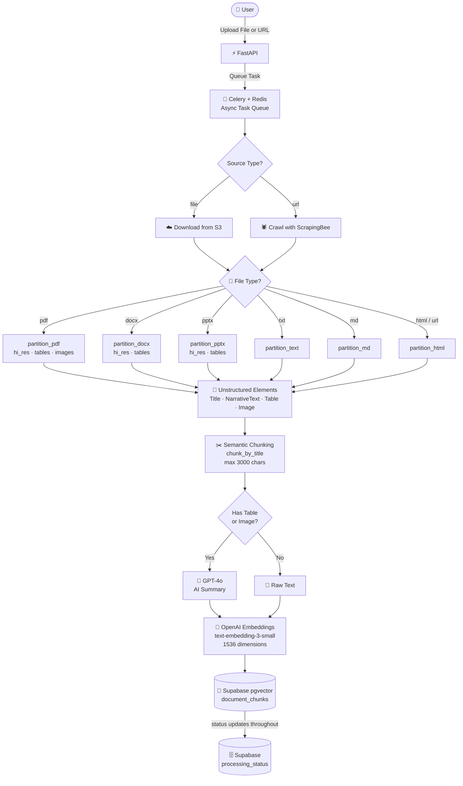
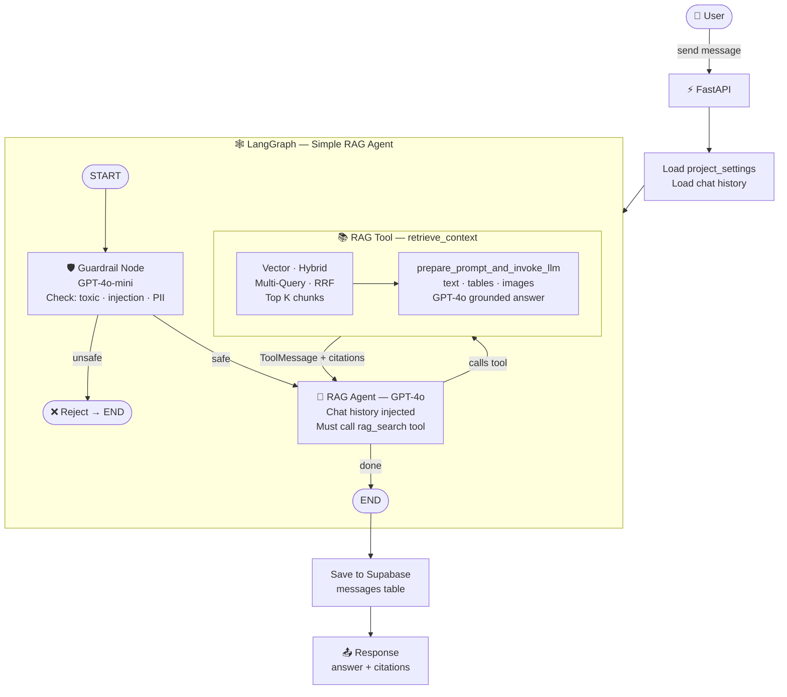
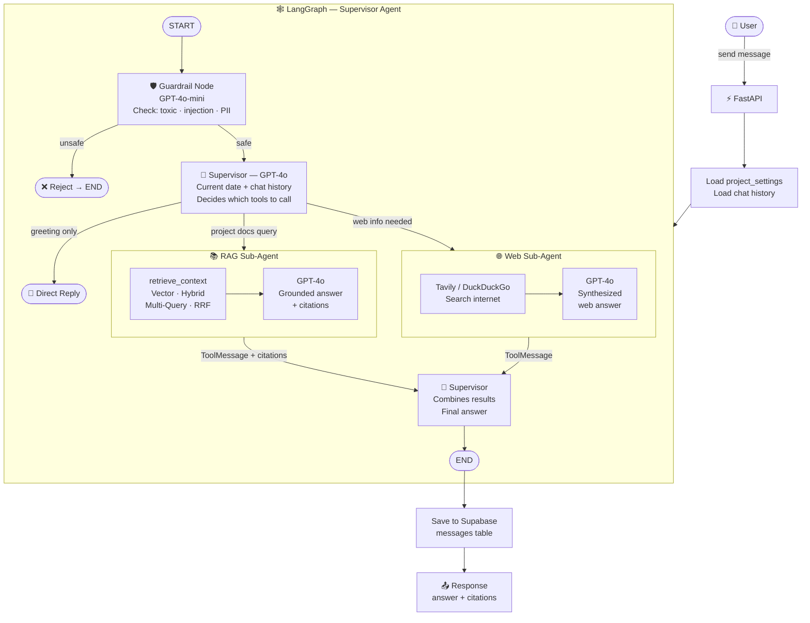

# Retriva RAG System
---

## Ingestion Pipeline detailed :

```mermaid
flowchart TD

    USER(["👤 User"]) -->|Upload File or URL| API["⚡ FastAPI"]

    API -->|Queue Task| CELERY["🌿 Celery + Redis\nAsync Task Queue"]

    CELERY --> ACQUIRE{"Source Type?"}

    ACQUIRE -->|file| S3["☁️ Download from S3"]
    ACQUIRE -->|url| CRAWL["🕷️ Crawl with ScrapingBee"]

    S3 --> PARTITION{"📄 File Type?"}
    CRAWL --> PARTITION

    PARTITION -->|pdf| PDF["partition_pdf\nhi_res · tables · images"]
    PARTITION -->|docx| DOCX["partition_docx\nhi_res · tables"]
    PARTITION -->|pptx| PPTX["partition_pptx\nhi_res · tables"]
    PARTITION -->|txt| TXT["partition_text"]
    PARTITION -->|md| MD["partition_md"]
    PARTITION -->|html / url| HTML["partition_html"]

    PDF --> ELEMENTS["🧩 Unstructured Elements\nTitle · NarrativeText · Table · Image"]
    DOCX --> ELEMENTS
    PPTX --> ELEMENTS
    TXT --> ELEMENTS
    MD --> ELEMENTS
    HTML --> ELEMENTS

    ELEMENTS --> CHUNK["✂️ Semantic Chunking\nchunk_by_title\nmax 3000 chars"]

    CHUNK --> SUMMARIZE{"Has Table\nor Image?"}

    SUMMARIZE -->|Yes| AI["🤖 GPT-4o\nAI Summary"]
    SUMMARIZE -->|No| RAW["📝 Raw Text"]

    AI --> EMBED
    RAW --> EMBED

    EMBED["🧠 OpenAI Embeddings\ntext-embedding-3-small\n1536 dimensions"]

    EMBED --> STORE[("🐘 Supabase pgvector\ndocument_chunks")]

    STORE -->|status updates throughout| DB[("🗄️ Supabase\nprocessing_status")]
```
---

## Retrieval Pipeline with Rag Agent detailed :

```mermaid
flowchart TD

    USER(["👤 User"]) -->|send message| API["⚡ FastAPI"]

    API --> SETUP["Load project_settings\nLoad chat history"]
    SETUP --> GRAPH

    subgraph GRAPH ["🕸️ LangGraph — Simple RAG Agent"]

        START_NODE(["START"]) --> GUARDRAIL

        GUARDRAIL["🛡️ Guardrail Node\nGPT-4o-mini\nCheck: toxic · injection · PII"]

        GUARDRAIL -->|unsafe| REJECT(["❌ Reject → END"])
        GUARDRAIL -->|safe| AGENT

        AGENT["🤖 RAG Agent — GPT-4o\nChat history injected\nMust call rag_search tool"]

        AGENT -->|calls tool| RAG_TOOL

        subgraph RAG_TOOL ["📚 RAG Tool — retrieve_context"]
            R1["Vector · Hybrid\nMulti-Query · RRF\nTop K chunks"]
            R1 --> R2["prepare_prompt_and_invoke_llm\ntext · tables · images\nGPT-4o grounded answer"]
        end

        RAG_TOOL -->|ToolMessage + citations| AGENT
        AGENT -->|done| END_NODE(["END"])
    end

    END_NODE --> SAVE["Save to Supabase\nmessages table"]
    SAVE --> RESPONSE["📤 Response\nanswer + citations"]

```
---
## Multi Agent with RAG and webSearch :

```mermaid
flowchart TD

    USER(["👤 User"]) -->|send message| API["⚡ FastAPI"]

    API --> SETUP["Load project_settings\nLoad chat history"]
    SETUP --> GRAPH

    subgraph GRAPH ["🕸️ LangGraph — Supervisor Agent"]

        START_NODE(["START"]) --> GUARDRAIL

        GUARDRAIL["🛡️ Guardrail Node\nGPT-4o-mini\nCheck: toxic · injection · PII"]

        GUARDRAIL -->|unsafe| REJECT(["❌ Reject → END"])
        GUARDRAIL -->|safe| SUPERVISOR

        SUPERVISOR["🧠 Supervisor — GPT-4o\nCurrent date + chat history\nDecides which tools to call"]

        SUPERVISOR -->|project docs query| RAG_TOOL
        SUPERVISOR -->|web info needed| WEB_TOOL
        SUPERVISOR -->|greeting only| DIRECT(["💬 Direct Reply"])

        subgraph RAG_TOOL ["📚 RAG Sub-Agent"]
            R1["retrieve_context\nVector · Hybrid\nMulti-Query · RRF"]
            R1 --> R2["GPT-4o\nGrounded answer\n+ citations"]
        end

        subgraph WEB_TOOL ["🌐 Web Sub-Agent"]
            W1["Tavily / DuckDuckGo\nSearch internet"]
            W1 --> W2["GPT-4o\nSynthesized\nweb answer"]
        end

        RAG_TOOL -->|ToolMessage + citations| SYNTHESIZE
        WEB_TOOL -->|ToolMessage| SYNTHESIZE

        SYNTHESIZE["📝 Supervisor\nCombines results\nFinal answer"]
        SYNTHESIZE --> END_NODE(["END"])
    end

    END_NODE --> SAVE["Save to Supabase\nmessages table"]
    SAVE --> RESPONSE["📤 Response\nanswer + citations"]
```
