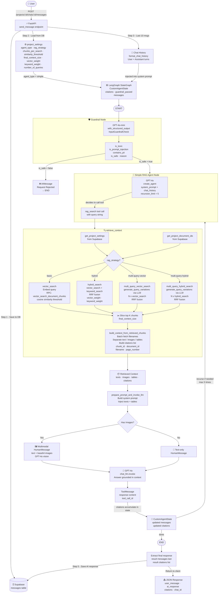

# Retriva RAG System
---

## Ingestion Pipeline detailed :

```mermaid
flowchart TD

    %% TRIGGER
    USER(["👤 User"])
    USER -->|Upload File| S3["☁️ AWS S3"]
    USER -->|Submit URL| URLDB["🔗 URL saved to Supabase"]

    S3 -->|POST /files/confirm| API["⚡ FastAPI API"]
    URLDB -->|POST /urls| API

    %% ASYNC QUEUE
    API -->|Queue Task| CELERY["🌿 Celery Task\nperform_rag_ingestion_task"]
    CELERY -->|Broker| REDIS[("🔴 Redis")]
    REDIS -->|Worker picks up| WORKER["⚙️ Celery Worker"]

    WORKER -->|status = PROCESSING| STATUSDB[("🗄️ Supabase\nproject_documents")]

    %% STEP 1 - ACQUIRE
    WORKER --> ACQUIRE{"Source Type?"}
    ACQUIRE -->|file| DL["⬇️ Download from S3\nboto3"]
    ACQUIRE -->|url| CRAWL["🕷️ Crawl URL\nScrapingBee API"]
    DL --> TEMPFILE["📁 Temp File"]
    CRAWL --> TEMPFILE

    %% STEP 2 - PARTITION
    TEMPFILE -->|status = PARTITIONING| PARTITION{"File Type?"}
    PARTITION -->|pdf| PDF["partition_pdf\nhi_res + tables\n+ image base64"]
    PARTITION -->|docx| DOCX["partition_docx\nhi_res + tables"]
    PARTITION -->|pptx| PPTX["partition_pptx"]
    PARTITION -->|txt| TXT["partition_text"]
    PARTITION -->|md| MD["partition_md"]
    PARTITION -->|html| HTML["partition_html"]

    PDF --> ELEMENTS["🧩 Unstructured Elements\nTitle · NarrativeText\nTable · Image · ListItem"]
    DOCX --> ELEMENTS
    PPTX --> ELEMENTS
    TXT --> ELEMENTS
    MD --> ELEMENTS
    HTML --> ELEMENTS

    ELEMENTS --> ANALYZE["📊 analyze_elements\nCount text / tables / images"]
    ANALYZE -->|elements summary| STATUSDB
    ELEMENTS -->|cleanup| CLEANUP["🗑️ Delete Temp File"]

    %% STEP 3 - CHUNKING
    ANALYZE -->|status = CHUNKING| CHUNK["✂️ chunk_by_title\nmax 3000 chars\nnew after 2400\ncombine under 500"]
    CHUNK -->|metrics| STATUSDB
    CHUNK --> CHUNKS["📦 Semantic Chunks"]

    %% STEP 4 - SUMMARISATION
    CHUNKS -->|status = SUMMARISING| SEPARATE["🔍 separate_content_types\ntext · tables · images"]
    SEPARATE --> HASRICH{"Has Table\nor Image?"}
    HASRICH -->|Yes| AISUM["🤖 GPT-4o\nAI Summary\nDescribes tables + images\nas searchable text"]
    HASRICH -->|No| PLAIN["📝 Use raw text"]
    AISUM --> PROCESSED["✅ processed_chunk\ncontent · original_content\ntype · page_number · char_count"]
    PLAIN --> PROCESSED

    %% STEP 5 - VECTORISATION
    PROCESSED -->|status = VECTORIZATION| BATCH["🔢 Batch Size = 10"]
    BATCH --> EMBED["🧠 OpenAI Embeddings\ntext-embedding-3-small\n1536 dimensions"]
    EMBED -->|Rate limit hit| RETRY["🔄 Exponential Backoff\nmax 3 retries"]
    RETRY --> EMBED
    EMBED --> VECTORS["📐 Embedding Vectors\n1536-dim per chunk"]

    %% STEP 6 - STORAGE
    VECTORS --> ZIP["🔗 zip chunks + embeddings"]
    ZIP --> INSERT["💾 INSERT to Supabase"]
    INSERT -->|status = COMPLETED| STATUSDB
    INSERT --> PGVECTOR[("🐘 PostgreSQL + pgvector\ndocument_chunks\nid · content · original_content\ntype · page_number · embedding\nfts tsvector")]
```
---

## Retrival Pipeline with Rag Agent detailed :

```mermaid
flowchart TD

    %% ── ENTRY POINT ──────────────────────────────
    USER(["👤 User"])
    USER -->|POST /projects/:id/chats/:id/messages| API["⚡ FastAPI\nsend_message endpoint"]

    API -->|Step 1 - Save to DB| MSGDB[("🗄️ Supabase\nmessages table")]
    API -->|Step 2 - Load from DB| SETTINGS["⚙️ project_settings\nagent_type · rag_strategy\nchunks_per_search · similarity_threshold\nfinal_context_size · vector_weight\nkeyword_weight · number_of_queries"]
    API -->|Step 3 - Last 10 msgs| HISTORY["💬 Chat History\nformat_chat_history\nUser + Assistant turns"]

    %% ── LANGGRAPH AGENT ──────────────────────────
    SETTINGS -->|agent_type = simple| GRAPH["🕸️ LangGraph StateGraph\nCustomAgentState\ncitations · guardrail_passed\nmessages"]
    HISTORY -->|injected into system prompt| GRAPH

    GRAPH --> START_NODE(["START"])
    START_NODE --> GUARDRAIL

    %% ── GUARDRAIL NODE ───────────────────────────
    subgraph GUARDRAIL_NODE ["🛡️ Guardrail Node"]
        GUARDRAIL["GPT-4o-mini\nwith_structured_output\nInputGuardrailCheck"]
        GUARDRAIL --> CHECKS["is_toxic\nis_prompt_injection\ncontains_pii\nis_safe · reason"]
    end

    CHECKS -->|is_safe = false| REJECT["❌ AIMessage\nRequest Rejected\n→ END"]
    CHECKS -->|is_safe = true| AGENT_NODE

    %% ── AGENT NODE ───────────────────────────────
    subgraph AGENT_NODE ["🤖 Simple RAG Agent Node"]
        AGENT["GPT-4o\ncreate_agent\nsystem_prompt + chat_history\nrecursion_limit = 5"]
        AGENT -->|decides to call tool| TOOL_CALL["rag_search tool call\nwith query string"]
    end

    %% ── RAG TOOL ─────────────────────────────────
    TOOL_CALL --> RETRIEVE

    subgraph RETRIEVE ["🔍 retrieve_context"]

        SETTINGS2["get_project_settings\nfrom Supabase"]
        DOCIDS["get_project_document_ids\nfrom Supabase"]

        SETTINGS2 --> STRATEGY{"rag_strategy?"}
        DOCIDS --> STRATEGY

        STRATEGY -->|basic| VS["vector_search\nEmbed query\nRPC: vector_search_document_chunks\ncosine similarity threshold"]
        STRATEGY -->|hybrid| HS["hybrid_search\nvector_search + keyword_search\nRRF fusion\nvector_weight · keyword_weight"]
        STRATEGY -->|multi-query-vector| MQV["multi_query_vector_search\ngenerate_query_variations via LLM\nN x vector_search\nRRF fusion"]
        STRATEGY -->|multi-query-hybrid| MQH["multi_query_hybrid_search\ngenerate_query_variations via LLM\nN x hybrid_search\nRRF fusion"]

        VS --> TOPK["✂️ Slice top K chunks\nfinal_context_size"]
        HS --> TOPK
        MQV --> TOPK
        MQH --> TOPK

        TOPK --> BUILD["build_context_from_retrieved_chunks\nBatch fetch filenames\nSeparate text / images / tables\nBuild citations list\nchunk_id · document_id\nfilename · page_number"]
    end

    BUILD --> CONTEXT["📦 Retrieved Context\ntexts · images · tables · citations"]

    %% ── LLM INVOCATION ───────────────────────────
    CONTEXT --> PROMPT["prepare_prompt_and_invoke_llm\nBuild system prompt\nInject texts + tables"]

    PROMPT --> IMGCHECK{"Has Images?"}
    IMGCHECK -->|Yes| MULTIMODAL["🖼️ Multimodal HumanMessage\ntext + base64 images\nGPT-4o vision"]
    IMGCHECK -->|No| TEXTONLY["📝 Text-only HumanMessage"]

    MULTIMODAL --> LLM["🧠 GPT-4o\nchat_llm.invoke\nAnswer grounded in context"]
    TEXTONLY --> LLM

    LLM --> TOOLMSG["ToolMessage\nresponse content\ntool_call_id"]
    TOOLMSG -->|citations accumulate in state| AGENTSTATE["🔄 CustomAgentState\nupdated messages\nupdated citations"]

    AGENTSTATE -->|recurse if needed\nmax 5 times| AGENT_NODE
    AGENTSTATE -->|done| END_NODE(["END"])

    %% ── RESPONSE ─────────────────────────────────
    END_NODE --> EXTRACT["Extract final response\nresult messages last\nresult citations list"]
    EXTRACT -->|Step 5 - Save AI response| MSGDB
    EXTRACT -->|Return to client| RESPONSE["📤 JSON Response\nuser_message · ai_response\ncitations · chat_id"]

```
---
## Multi Agent with RAG and webSearch :

```mermaid
flowchart TD

    USER(["👤 User"]) -->|send message| API["⚡ FastAPI"]

    API --> SETUP["Load project_settings\nLoad chat history"]
    SETUP --> GRAPH

    subgraph GRAPH ["🕸️ LangGraph — Supervisor Agent"]

        START_NODE(["START"]) --> GUARDRAIL

        GUARDRAIL["🛡️ Guardrail Node\nGPT-4o-mini\nCheck: toxic · injection · PII"]

        GUARDRAIL -->|unsafe| REJECT(["❌ Reject → END"])
        GUARDRAIL -->|safe| SUPERVISOR

        SUPERVISOR["🧠 Supervisor — GPT-4o\nCurrent date + chat history\nDecides which tools to call"]

        SUPERVISOR -->|project docs query| RAG_TOOL
        SUPERVISOR -->|web info needed| WEB_TOOL
        SUPERVISOR -->|greeting only| DIRECT(["💬 Direct Reply"])

        subgraph RAG_TOOL ["📚 RAG Sub-Agent"]
            R1["retrieve_context\nVector · Hybrid\nMulti-Query · RRF"]
            R1 --> R2["GPT-4o\nGrounded answer\n+ citations"]
        end

        subgraph WEB_TOOL ["🌐 Web Sub-Agent"]
            W1["Tavily / DuckDuckGo\nSearch internet"]
            W1 --> W2["GPT-4o\nSynthesized\nweb answer"]
        end

        RAG_TOOL -->|ToolMessage + citations| SYNTHESIZE
        WEB_TOOL -->|ToolMessage| SYNTHESIZE

        SYNTHESIZE["📝 Supervisor\nCombines results\nFinal answer"]
        SYNTHESIZE --> END_NODE(["END"])
    end

    END_NODE --> SAVE["Save to Supabase\nmessages table"]
    SAVE --> RESPONSE["📤 Response\nanswer + citations"]
```
