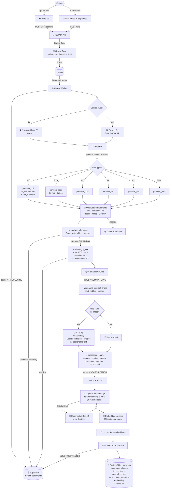

# Retriva RAG System
---

## Ingestion Pipeline detailed :

```mermaid
flowchart TD

    %% TRIGGER
    USER(["👤 User"])
    USER -->|Upload File| S3["☁️ AWS S3"]
    USER -->|Submit URL| URLDB["🔗 URL saved to Supabase"]

    S3 -->|POST /files/confirm| API["⚡ FastAPI API"]
    URLDB -->|POST /urls| API

    %% ASYNC QUEUE
    API -->|Queue Task| CELERY["🌿 Celery Task\nperform_rag_ingestion_task"]
    CELERY -->|Broker| REDIS[("🔴 Redis")]
    REDIS -->|Worker picks up| WORKER["⚙️ Celery Worker"]

    WORKER -->|status = PROCESSING| STATUSDB[("🗄️ Supabase\nproject_documents")]

    %% STEP 1 - ACQUIRE
    WORKER --> ACQUIRE{"Source Type?"}
    ACQUIRE -->|file| DL["⬇️ Download from S3\nboto3"]
    ACQUIRE -->|url| CRAWL["🕷️ Crawl URL\nScrapingBee API"]
    DL --> TEMPFILE["📁 Temp File"]
    CRAWL --> TEMPFILE

    %% STEP 2 - PARTITION
    TEMPFILE -->|status = PARTITIONING| PARTITION{"File Type?"}
    PARTITION -->|pdf| PDF["partition_pdf\nhi_res + tables\n+ image base64"]
    PARTITION -->|docx| DOCX["partition_docx\nhi_res + tables"]
    PARTITION -->|pptx| PPTX["partition_pptx"]
    PARTITION -->|txt| TXT["partition_text"]
    PARTITION -->|md| MD["partition_md"]
    PARTITION -->|html| HTML["partition_html"]

    PDF --> ELEMENTS["🧩 Unstructured Elements\nTitle · NarrativeText\nTable · Image · ListItem"]
    DOCX --> ELEMENTS
    PPTX --> ELEMENTS
    TXT --> ELEMENTS
    MD --> ELEMENTS
    HTML --> ELEMENTS

    ELEMENTS --> ANALYZE["📊 analyze_elements\nCount text / tables / images"]
    ANALYZE -->|elements summary| STATUSDB
    ELEMENTS -->|cleanup| CLEANUP["🗑️ Delete Temp File"]

    %% STEP 3 - CHUNKING
    ANALYZE -->|status = CHUNKING| CHUNK["✂️ chunk_by_title\nmax 3000 chars\nnew after 2400\ncombine under 500"]
    CHUNK -->|metrics| STATUSDB
    CHUNK --> CHUNKS["📦 Semantic Chunks"]

    %% STEP 4 - SUMMARISATION
    CHUNKS -->|status = SUMMARISING| SEPARATE["🔍 separate_content_types\ntext · tables · images"]
    SEPARATE --> HASRICH{"Has Table\nor Image?"}
    HASRICH -->|Yes| AISUM["🤖 GPT-4o\nAI Summary\nDescribes tables + images\nas searchable text"]
    HASRICH -->|No| PLAIN["📝 Use raw text"]
    AISUM --> PROCESSED["✅ processed_chunk\ncontent · original_content\ntype · page_number · char_count"]
    PLAIN --> PROCESSED

    %% STEP 5 - VECTORISATION
    PROCESSED -->|status = VECTORIZATION| BATCH["🔢 Batch Size = 10"]
    BATCH --> EMBED["🧠 OpenAI Embeddings\ntext-embedding-3-small\n1536 dimensions"]
    EMBED -->|Rate limit hit| RETRY["🔄 Exponential Backoff\nmax 3 retries"]
    RETRY --> EMBED
    EMBED --> VECTORS["📐 Embedding Vectors\n1536-dim per chunk"]

    %% STEP 6 - STORAGE
    VECTORS --> ZIP["🔗 zip chunks + embeddings"]
    ZIP --> INSERT["💾 INSERT to Supabase"]
    INSERT -->|status = COMPLETED| STATUSDB
    INSERT --> PGVECTOR[("🐘 PostgreSQL + pgvector\ndocument_chunks\nid · content · original_content\ntype · page_number · embedding\nfts tsvector")]
```
